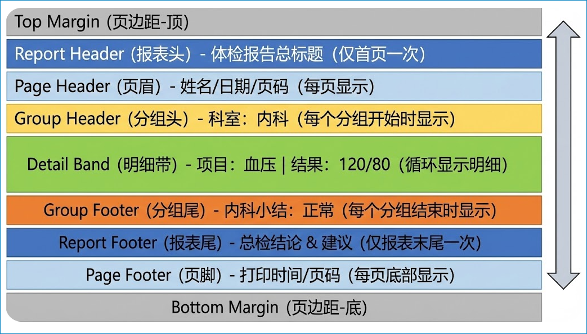
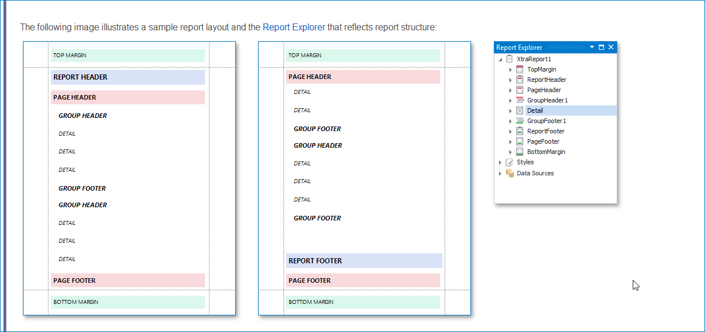
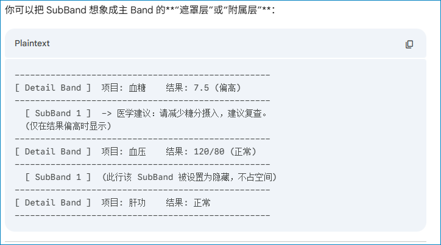
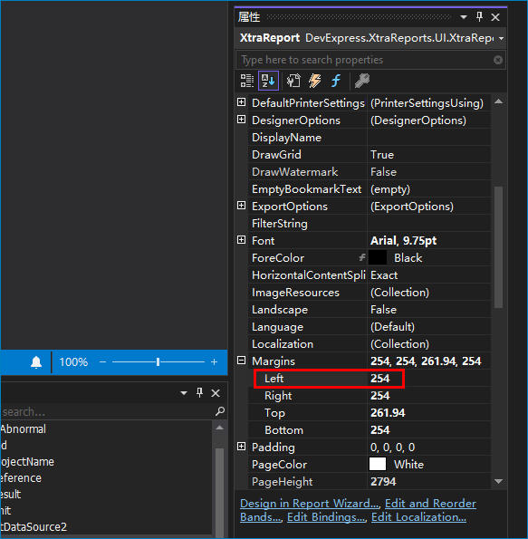

# DevExpress报表理解

## 层级说明





## 关于SubBand的说明



异常结果的“条件”性显示。

## 疑问：Report Footer 怎么在 Page Footer 之上？

默认的物理视觉位置（从上往瞎看）上，标准的顺序其实是：Report Footer 在上， Page Footer在最底下。

为了彻底讲清楚，我们必须把目光聚焦在**“最后一页”**（因为只有最后一页这两个才会同时出现）。

### 1. 核心区别

- **Report Footer（报表尾/总计）**：
  - **定义**：它是**“数据的终点”**。
  - **位置**：它紧紧跟在最后一条 Detail 数据或者 Group Footer 之后。如果你的数据只占了页面的 1/3，那么 Report Footer 就会出现在页面的 1/3 处（页面中间）。
  - **用途**：显示“全院总检结论”、“总金额”、“签字盖章处”。
- **Page Footer（页脚）**：
  - **定义**：它是**“纸张的底边”**。
  - **位置**：它永远固定在**页面的最底部**（紧贴 Bottom Margin）。不管上面的数据有多少，它都雷打不动地沉底。
  - **用途**：显示“第 X 页 / 共 Y 页”、“打印时间”、“版权信息”。

------

### 2. 视觉示意图（最后一页的样子）

假设这是一张体检报告的最后一页：

Plaintext

```
--------------------------------------------------
|  [Page Header]  张三  男  2026-01-12           |
--------------------------------------------------
|  [Detail]       谷丙转氨酶    12     正常      |
|  [Detail]       谷草转氨酶    20     正常      |
|  [Detail]       总胆红素      15     正常      |  <-- 数据在这里结束了
--------------------------------------------------
|  [Report Footer]                               |
|  总检医生：李四                                |
|  建议：注意休息，少熬夜。                      |  <-- 紧接着数据出现
--------------------------------------------------
|                                                |
|            (这里是一大片空白区域)              |
|            (White Space)                       |
|                                                |
--------------------------------------------------
|  [Page Footer]                                 |
|  打印时间: 14:00            第 5 页 / 共 5 页  |  <-- 永远沉底
--------------------------------------------------
      (Bottom Margin)
```

**所以，从上往下的物理顺序是：Report Footer ——> (空白) ——> Page Footer。**

------

### 3. 特殊情况：你想要 Report Footer 也沉底吗？

DevExpress 知道有时候用户（比如做发票或合同）希望 `Report Footer`（总金额）也沉到页面底部，紧挨着 `Page Footer`。

如果你想要这种效果，你需要设置属性：

- 选中 **Report Footer** 带区。
- 在属性面板中找到 **`PrintAtBottom`**。
- 设置为 **`True`**。

设置后的效果：

Plaintext

```
...
|  [Detail]       总胆红素      15     正常      |
--------------------------------------------------
|                                                |
|            (空白区域跑到中间来了)              |
|                                                |
--------------------------------------------------
|  [Report Footer]  总检医生：李四               | <-- 被强制推到了底部
--------------------------------------------------
|  [Page Footer]    第 5 页 / 共 5 页            | <-- 依然是最底部
--------------------------------------------------
```

### 总结

- **Page Footer** 是物理层面的“页底”，它是**真正的最后**。
- **Report Footer** 是逻辑层面的“文末”，默认情况下，它只是跟在数据屁股后面。

## 疑问：Top Margin 和 Bottom Margin 这两个区域的作用？

这两个区域虽然看起来只是“空白”，但在DevExpress报表设计中，它们扮演者**“物理界限”和“背景图层”**的双重角色。

千万不要把它们仅仅当成“什么都不放的留白”，在实际的体检报告开发中，它们有三个非常具体的用途：

### 1. 物理层面的“安全区” (Hardware Limitations)

这是最基础的作用。

- **打印机限制**：绝大多数办公打印机（激光/喷墨）都无法做到“无边距打印”。喷头或滚轮需要抓住纸张的边缘，通常会有 5mm 左右的“打印死角”。
- **作用**：Top/Bottom Margin 确保你的核心内容（比如体检结论）不会因为打印机的机械原因被切掉。

### 2. 模拟“预印信纸” (The Stationery Effect)

这是 Top Margin 最隐秘但也最强大的用法。

想象一下，医院通常会去印刷厂定制一批**“红头信纸”**，上面已经印好了红色的医院 Logo 和横线，然后把这些纸放进打印机打印黑色的体检数据。

在 DevExpress 中，**Top Margin 就相当于这个“红头”**。

- **特性**：如果你把 Logo 图片或医院名称拖到 Top Margin 区域里，它会显示在每一页的最顶端。
- **与 Page Header 的区别**：
  - **Top Margin** 里的内容是相对于**纸张边缘**定位的（绝对坐标）。
  - **Page Header** 里的内容是相对于**Margin 结束的位置**定位的。

> **实战场景**： 如果你的体检报告需要打印在**白纸**上，但要做出“红头文件”的效果，请把医院 Logo 和顶部装饰线放在 **Top Margin** 里，而不是 Page Header 里。这样显得更像是一个“底板”。

下面是个“红头信纸”的示例：

|  |  |
| :----------------------------------------------------------: | ------------------------------------------------------------ |

### 3. 装订线预留 (Binding / Gutter)

体检报告打印出来后，通常需要侧面装订或顶部装订。

- 如果是**顶部装订**，你需要把 **Top Margin** 设置得大一点（比如 2.5cm），留出打孔的位置，防止把标题打穿了。
- 如果是**侧面装订**，DevExpress 其实还有一个隐藏属性叫 **Margins.Left** (左边距)，通常左边距要比右边距大，也是为了留出装订线。



### 总结：四个区域的层级关系

为了帮你彻底理清，我们来看一个体检报告的垂直结构图：

| **区域**          | **作用**       | **对应体检报告的内容**                                |
| ----------------- | -------------- | ----------------------------------------------------- |
| **Top Margin**    | **物理顶端**   | 医院的固定 Logo、红头装饰线（每一页都有，雷打不动）。 |
| **Report Header** | **内容的开始** | **“体检报告”** 四个大字、条形码（只在第一页出现）。   |
| **Page Header**   | **页面的眉毛** | 姓名：张三、科室：内科（每一页都有，随着内容走）。    |
| **Detail**        | **正文**       | 具体的检查项目数据。                                  |
| **Report Footer** | **内容的结束** | 总检医生签名、盖章（紧跟在最后一条数据后面）。        |
| **Page Footer**   | **页面的脚底** | 第 X 页 / 共 Y 页（每一页都有）。                     |
| **Bottom Margin** | **物理底端**   | 只有留白，或者微小的版权声明（通常不放重要内容）。    |

## 疑问：Group Header 和 Group Footer作用？

在报告中，这两个Band负责**“对数据进行分类和归纳”**。

------

### 1. 举个体检的例子

想象一下，一个人的体检报告里有 20 多个检查项（白细胞、红细胞、谷丙转氨酶、收缩压、舒张压...）。

如果你只是简单地把它们罗列出来，医生根本没法看。你需要按照**科室**或**检查类别**把它们分堆：

- **[Group Header]：血常规检查**（这里放分类名称和表格标题）
  - [Detail]：白细胞计数 ...
  - [Detail]：红细胞计数 ...
- **[Group Footer]：(本分类小结)**：血液检查指标基本正常。

------

**[Group Header]：肝功能检查**

- [Detail]：谷丙转氨酶 ...
- [Detail]：总胆红素 ...

**[Group Footer]：(本分类小结)**：转氨酶偏高，建议复查。

------

### 2. 它们的核心作用

| **区域**         | **作用**           | **体检报告中的具体应用**                                     |
| ---------------- | ------------------ | ------------------------------------------------------------ |
| **Group Header** | **开启一个新类别** | 1. 显示科室名称（如“内科”、“化验室”）。 2. 显示该分类专有的表格列头（项目名、结果、参考值）。 |
| **Group Footer** | **结束一个类别**   | 1. 放置该科室的医生电子签名。 2. 放置针对该类别的“科室小结”。 3. 统计该分类下“异常项”的总数。 |

### 3. 进阶小技巧：分页控制

在体检报告中，我们经常要求：**“每个科室必须从新的一页开始打印”**。

- 你只需要选中 **Group Header**。
- 在属性面板找到 **`PageBreak`**。
- 设置为 **`BeforeBand`**（在带区前分页）。
- 这样，你的血常规和肝功能就会完美地分在不同的纸张上，不会挤在一起。

------

### 总结

- **Report Header/Footer**：整个报告的头尾（全报表仅一次）。
- **Page Header/Footer**：每一页纸的头尾（每页都有）。
- **Group Header/Footer**：逻辑分类的头尾（有几个分类就有几对）。